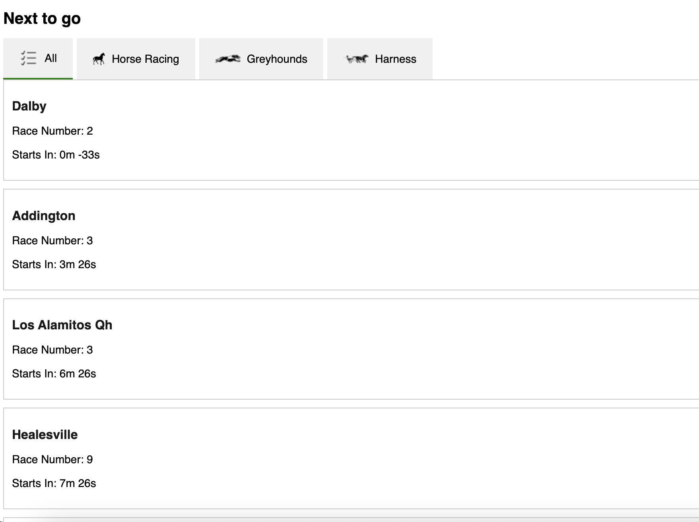

# Next to Go Races

This project is a single-page application built using React.js and TypeScript that displays the "Next to Go" races using an external API. Users can see the next 5 races, sorted by time in ascending order, and the races will disappear from the list one minute after their start time. Users can also filter races by category.

## Features

- Display the next 5 races sorted by start time.
- Countdown timer for each race indicating the time until the start.
- Automatic removal of races from the list one minute after their start time.
- Category filtering to view races of selected categories (Greyhound, Harness, Horse).
- Auto-refreshes the race list every minute.

## Technologies Used

- React.js
- TypeScript
- Axios (for API requests)
- Moment.js (for date and time manipulation)
- CSS for styling

## Installation

1. Clone the repository:
    ```sh
    git clone https://github.com/bhartineha/next-to-go-races.git
    cd next-to-go-races
    ```

2. Install dependencies:
    ```sh
    npm install
    ```

3. Start the development server:
    ```sh
    npm start
    ```

4. Linting
    ```sh
    npm run lint
    ```


The application should now be running on `http://localhost:3000`.

## Usage

1. Open the application in your browser.
2. The main view displays the next 5 races.
3. Use the buttons at the top to filter races by category:
    - Greyhound Racing
    - Harness Racing
    - Horse Racing
    - All (shows all races)
4. Each race shows:
    - Meeting Name
    - Race Number
    - Countdown timer indicating the start of the race

## API

This application uses the following API endpoint to fetch race data:
https://api.neds.com.au/rest/v1/racing/?method=nextraces&amp;count=10

## Project Screenshot


